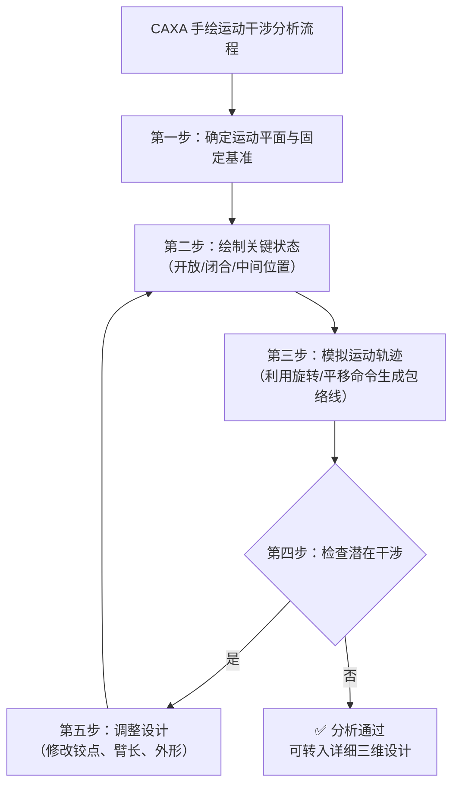

---
title:
  - 电源安装吊装夹爪设计思路
tags:
  - 金康项目
---
![[img/20250915-162315.png]]

### 设计输入
### 概念设计

```mermaid
%%{init: {'flowchart': {'width': '150%'}}}%%
flowchart TD
    A[CAXA 手绘运动干涉分析流程] --> B[第一步：确定运动平面与固定基准]
    B --> C[第二步：绘制关键状态<br>（开放/闭合/中间位置）]
    C --> D[第三步：模拟运动轨迹<br>（利用旋转/平移命令生成包络线）]
    D --> E{第四步：检查潜在干涉}
    E -- 是 --> F[第五步：调整设计<br>（修改铰点、臂长、外形）]
    F --> C
    E -- 否 --> G[✅ 分析通过<br>可转入详细三维设计]
```

### 详细设计