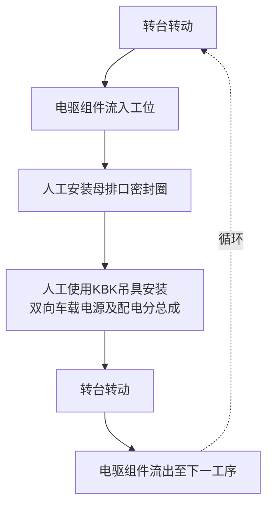

---
title:
  - 电源安装手动工位
tags:
  - 金康项目
---
### 装配内容

| 序号  | SAI500             | SX150B           | SX250H       |
| --- | ------------------ | ---------------- | ------------ |
| 1   | 三相盖板密封圈            | 电机尾盖             | 双向车载电源及配电分总成 |
| 2   | 三相盖板               | 六角法兰面螺栓M6*16  |              |
| 3   | 内六角花型盘头螺钉M6*16  |                  |              |

### 防错及质量监控

RFID 读取功能
拧紧力矩、拧紧角度、拧紧数量、拧紧顺序与产品绑定上传至 MES
扭力枪具备扭力、拧紧角度、旋入角度监控功能，螺栓扭力满足要求：
套筒选择器、扭力枪程序、PLC程序三者应当统一，其中一种未达到操作条件
扭力枪不得运行，防止拧紧程序错误，导致螺栓未紧或拧断

### 动作节拍分解

|         |                                 |     |      |      |
| ------- | ------------------------------- | --- | ---- | ---- |
| 序号      | 名称                              | 节拍  | 重复节拍 | 节拍合计 |
| SAI500H |                                 |     |      |      |
| 1       | 转台转动，电驱组件流入                     | 5   | /    | 75   |
| 2       | 人工拾取三相盖板密封圈、三相盖板并依次安装到电驱组件上     | 20  | /    |      |
| 3       | 人工预紧8颗三相盖板M6*16内六角花型盘头螺栓        | 45  | /    |      |
| 4       | 转台转动，电驱组件流出                     | 5   | /    |      |
| SX150B  |                                 |     |      |      |
| 1       | 转台转动，电驱组件流入                     | 5   | /    | 70   |
| 2       | 人工拾取电机尾盖安装到电驱组件上                | 10  | /    |      |
| 3       | 人工预紧电机尾盖螺栓                      | 50  | /    |      |
| 4       | 转台转动，电驱组件流出                     | 5   | /    |      |
| SX250H  |                                 |     |      |      |
| 1       | 转台转动，电驱组件流入                     | 5   | /    | 50   |
| 2       | 人工安装母排口密封圈                      | 10  | /    |      |
| 3       | 人工使用KBK吊具将双向车载电源及配电分总成安装到电驱对应位置 | 30  | /    |      |
| 4       | 转台转动，电驱组件流出                     | 5   | /    |      |

### 工位配置分解

|     |               |       |     |     |
| --- | ------------- | ----- | --- | --- |
| 序号  | 零件名称          | 参数    | 数量  | 备注  |
| 1   | KBK+吊具$3*2*3$ | MOSES | 1   | /   |
| 2   | 手持式扫码枪        | 新大陆   | 1   | /   |
| 3   | 套筒选择器         | MOSES | 1   | /   |
| 4   | 气动预紧枪         | 国优    | 1   | /   |
| 5   | 螺钉计数器         | 荣逸    | 1   | /   |
| 6   | 安全光栅+双手按钮     | MOSES | 1   | /   |

### 整体流程

![[img/20250913-113648.png|277]]

![[img/20250913-113648.png|278]]

参考[发动机装配工艺全过程_哔哩哔哩_bilibili](https://www.bilibili.com/video/BV1ZX4y1o7eS/?vd_source=62f3cbe2cb6ba559e333906f1754b94b)
视频定位2：54
### 物料需求

### 工位配置特性

1.[[20250915-160231|吊装夹爪]]与吊具吊钩连接，用于卡紧电源。夹爪负载重量为电源重量。

夹具选择**自重锁紧 + 机械防脱保险**或者**动力驱动锁紧（[[../concept/气缸|气缸]]）+ 失电/失气自锁**。

目前倾向**自重锁紧夹爪**，夹爪需要设置定位销，定位销与对齐工装上的导向孔配合，确保电源与壳体的螺栓孔精确对齐。
自重锁紧机构动作后，有一个弹簧销或卡板自动弹出，物理上阻止夹爪打开。需要手动解除保险后才能松开工件。
![[img/20250913-191042.png|300]]

**2.kbk吊具**在选择上考虑下面三种类型，吊具负载重量为**夹爪重量+电源重量**。吊具安全系数取4：1（吊具额定负载 ≥ 总重量 × 4）。
![[img/20250915-114722.png|330]]
![[img/20250915-114951.png|345]]
![[img/20250915-115116.png|300]]

**3.对齐工装**需要有导向孔能够与夹爪上的定位销配合；设置的高度能够将电源配合面与壳体配合面刚好重合。

![[img/20250915-115933.png]]        

**4.物料架**中需要包含内六角花形盘头螺钉$M6*16$&六角法兰面螺栓$M6*16$供钉机，存放三相盖板密封圈、母排口密封圈的物料盒各一个。

![[../canvas/20250913-111338.canvas]]